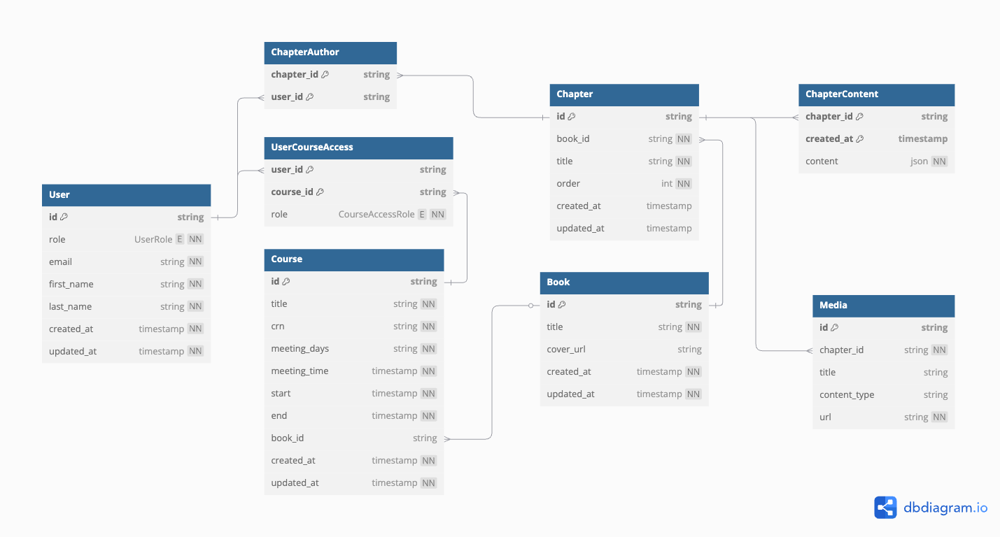

## Artissimo - A LMS

Artissimo is a custom learning management system built for the University of South Carolina School of Music.

### Tech Stack

- [Next.js](https://nextjs.org/) – Framework
- [TypeScript](https://www.typescriptlang.org/) – Language
- [Tailwind](https://tailwindcss.com/) – CSS
- [shadcn/ui](https://ui.shadcn.com) - UI Components
- [Prisma](https://prisma.io) - ORM [](https://prisma.io)
- [Supabase](https://supabase.co/) – Database + Authentication (Supabase is a managed [PostgreSQL](https://www.postgresql.org/) database)

### Getting Started

Run the following command to install project dependencies:

```bash
npm install
```

Next, create a `.env` file in the root directory and add your Supabase database credentials:

```
DATABASE_URL=""

NEXT_PUBLIC_SUPABASE_URL=""
NEXT_PUBLIC_SUPABASE_ANON_KEY=""
```

`DATABASE_URL` is your database's connection string. Your `NEXT_PUBLIC_SUPABASE_URL` and `NEXT_PUBLIC_SUPABASE_ANON_KEY` values can be found in the Supabase console.

Finally, seed an admin user in the database:

```bash
npm run db:seed -- --email "<email>" --name "<name>" --password "<password>"
```

This should only be done once. To create new users, login with the seeded user and create additional users in the UI. After running this step, you'll need to login to your inbox and confirm your email via a link Supabase will send you.

### Core Concepts

Artissimo was designed to host learning content in a book-based structure. Below are definitions of some core concepts:

* **Users**: Users of the app, which come in four permission-based flavors: admin, instructor, student, and guest
    * Each user type is associated with a slightly different in-app view
* **Books**: Collections of chapters
* **Chapters**: A knowledge entity containing text, inline reflection questions, and attached media
* **Courses**: Segmented groups of users
    * A course is associated with one book, allowing users of the course to access the chapters within the book

### Data Models

Below is a diagram of the database models (created using [dbdiagram.io](https://dbdiagram.io/)):



### Development Roadmap

This project is currently in active development. Please check back later!

#### V0
* Admin & Instructor Views
    * User management
    * Book / Chapter management
    * Course management
    * Role previews
* Student & Guest Views
    * Book / Chapter views

#### V1
* Inline reflection question versioning
* Admin & Instructor Views
    * Reflection question creation
    * Reflection question review and export
* Student & Guest Views
    * Reflection question submission
